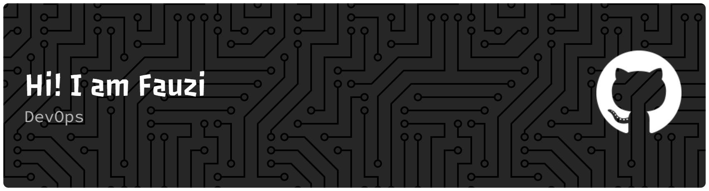

  

###

  

###

<h4 align="center">Connect with me:</h4>

###

  
  
  

###

<h1 align="center">Hey there 👋</h1>

###

<h3 align="left">👩‍💻  About Me</h3>

###

I'm Muhammad Ramdhani Fauzi DevOps Engineer

---

### 🛠️ Tech Stack

|                                      |                                  |
| ------------------------------------ | -------------------------------- |
| **Cloud & Infrastructure**           | ![][idcloudhost]                 |
| **Infrastructure as Code**           | ![][terraform] ![][ansible]      |
| **Containerization & Orchestration** | ![][docker] ![][kubernetes]      |
| **Package Manager**                  | ![][helm]                        |
| **CI/CD**                            | ![][jenkins] ![][github-actions] |
| **Code Quality & Security**          | ![][sonarqube]                   |
| **Monitoring & Logging**             | ![][prometheus] ![][grafana]     |
| **Web Server & Proxy**               | ![][nginx]                       |
| **OS & Scripting**                   | ![][linux] ![][bash]             |
| **Programming Language**             | ![][go] ![][nodejs] ![][php]     |
| **Database**                         | ![][mysql] ![][postgresql]       |
| **VCS**                              | ![][git] ![][github]             |

<!-- BADGE DEFINITIONS -->

[idcloudhost]: https://img.shields.io/badge/IDCloudHost-0066CC?style=flat&logo=icloud&logoColor=white
[terraform]: https://img.shields.io/badge/Terraform-7B42BC?style=flat&logo=terraform&logoColor=white
[ansible]: https://img.shields.io/badge/Ansible-EE0000?style=flat&logo=ansible&logoColor=white
[docker]: https://img.shields.io/badge/Docker-2496ED?style=flat&logo=docker&logoColor=white
[kubernetes]: https://img.shields.io/badge/Kubernetes-326CE5?style=flat&logo=kubernetes&logoColor=white
[helm]: https://img.shields.io/badge/Helm-0F1689?style=flat&logo=helm&logoColor=white
[jenkins]: https://img.shields.io/badge/Jenkins-D24939?style=flat&logo=jenkins&logoColor=white
[github-actions]: https://img.shields.io/badge/GitHub_Actions-2088FF?style=flat&logo=githubactions&logoColor=white
[gitlab-ci]: https://img.shields.io/badge/GitLab_CI-FC6D26?style=flat&logo=gitlab&logoColor=white
[sonarqube]: https://img.shields.io/badge/SonarQube-4E9BCD?style=flat&logo=sonarqubeserver&logoColor=white
[prometheus]: https://img.shields.io/badge/Prometheus-E6522C?style=flat&logo=prometheus&logoColor=white
[grafana]: https://img.shields.io/badge/Grafana-F46800?style=flat&logo=grafana&logoColor=white
[nginx]: https://img.shields.io/badge/Nginx-009639?style=flat&logo=nginx&logoColor=white
[linux]: https://img.shields.io/badge/Linux-FCC624?style=flat&logo=linux&logoColor=black
[bash]: https://img.shields.io/badge/Bash-4EAA25?style=flat&logo=gnubash&logoColor=white
[go]: https://img.shields.io/badge/Go-00ADD8?style=flat&logo=go&logoColor=white
[nodejs]: https://img.shields.io/badge/Node.js-5FA04E?style=flat&logo=nodedotjs&logoColor=white
[php]: https://img.shields.io/badge/PHP-777BB4?style=flat&logo=php&logoColor=white
[mysql]: https://img.shields.io/badge/MySQL-4479A1?style=flat&logo=mysql&logoColor=white
[postgresql]: https://img.shields.io/badge/PostgreSQL-4169E1?style=flat&logo=postgresql&logoColor=white
[git]: https://img.shields.io/badge/Git-F05032?style=flat&logo=git&logoColor=white
[github]: https://img.shields.io/badge/GitHub-181717?style=flat&logo=github&logoColor=white

###

    

###
